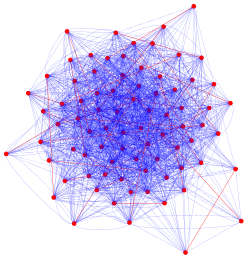
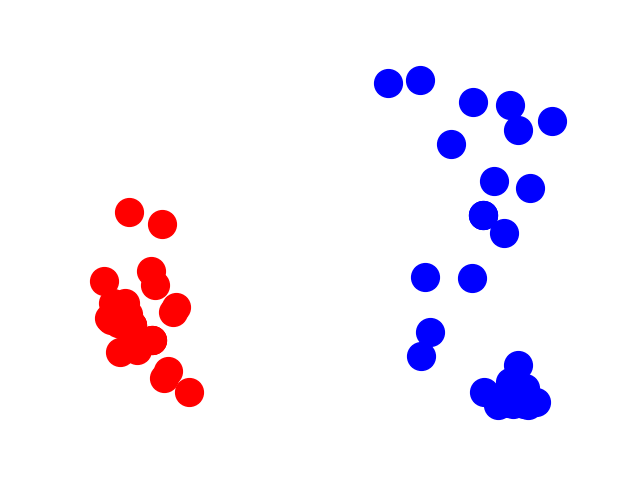
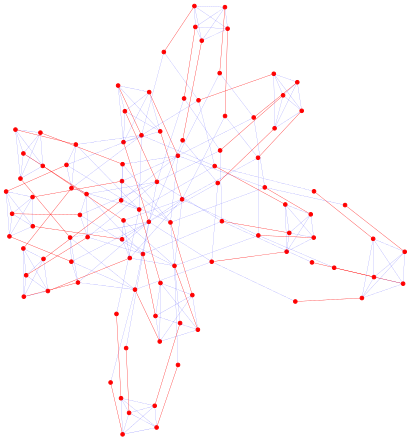
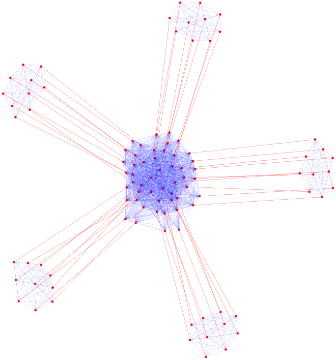
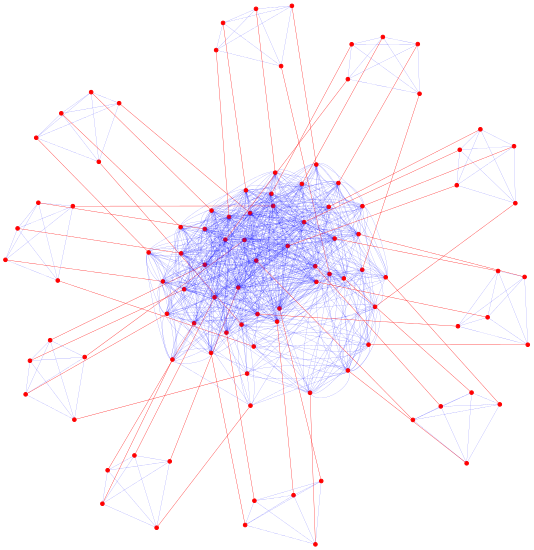
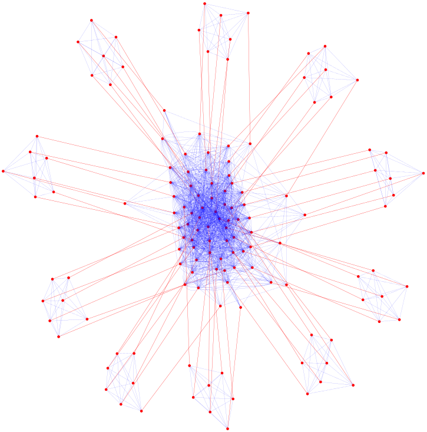

# NeuroSAT

NeuroSAT is an experimental SAT solver that is learned using single-bit supervision only. We train it as a classifier to predict satisfiability of random SAT problems and it learns to search for satisfying assignments to explain that bit of supervision. When it guesses _sat_, we can almost always decode the satisfying assignment it has found from its activations. It can often find solutions to problems that are bigger, harder, and from entirely different domains than those it saw during training.

Specifically, we train it as a classifier to predict satisfiability on random problems that look like this:

When making a prediction about a new problem, it guesses _unsat_ with low confidence (light blue) until it finds a satisfying assignment, at which point it guesses _sat_ with very high confidence (red) and converges:

                       

Iteration &rarr;

At convergence, the literal embeddings cluster according to the solution it finds:

We can almost always recover the solution by clustering the literal embeddings, thus making NeuroSAT an end-to-end SAT solver.

At test time it can often find solutions to

* bigger random problems:

* graph coloring problems:

* clique detection problems:

* dominating set problems:

* and vertex cover problems:

## Caveats

* The graph problems are derived from small random graphs (~10 nodes, ~17 edges on average).
* NeuroSAT is a research prototype and is still vastly less reliable than traditional SAT solvers.

## Reproducibility

As many readers know too well, facilitating exact reproducibility in machine learning can require a lot of work. NeuroSAT is no exception. We regret that we do not currently provide a push-button way to retrain our exact model on the exact same training data we used in our experiments, though we may provide such functionality in the future depending on the level of interest. For now, we settle for providing our model code, a generator for the distribution of problems we trained on, and enough scaffolding to easily train and test it on small datasets. More utilities will be added in the coming weeks. We hope users will adapt our code to their own infrastructures, improve upon our model, and train it on a greater variety of problems.

## Playing with NeuroSAT

The `scripts/` directory includes a few scripts to get started.
1. `setup.sh` installs dependencies.
2. `toy_gen_data.sh` generates toy train and test data.
3. `toy_train.sh` trains a model for a few iterations on the toy training data.
4. `toy_test.sh` evaluates the trained model on the toy test data.
5. `toy_solve.sh` tries to solve the toy test problems.
6. `toy_pipeline.sh` runs `toy_gen_data.sh`, `toy_train.sh`, `toy_test.sh`, and `toy_solve.sh` in sequence.

These scripts can be easily modified to train and test on larger datasets.

## Resources

More information about NeuroSAT can be found in the paper <https://arxiv.org/abs/1802.03685>.

## Team

* [Daniel Selsam](https://web.stanford.edu/~dselsam/), Stanford University
* [Matthew Lamm](https://github.com/mrlamm), Stanford University
* [Benedikt B&uuml;nz](https://crypto.stanford.edu/~buenz/), Stanford University
* [Percy Liang](https://cs.stanford.edu/~pliang/), Stanford University
* [Leonardo de Moura](https://leodemoura.github.io/), Microsoft Research
* [David L. Dill](http://verify.stanford.edu/dill), Stanford University

## Acknowledgments

This work was supported by Future of Life Institute grant 2017-158712.